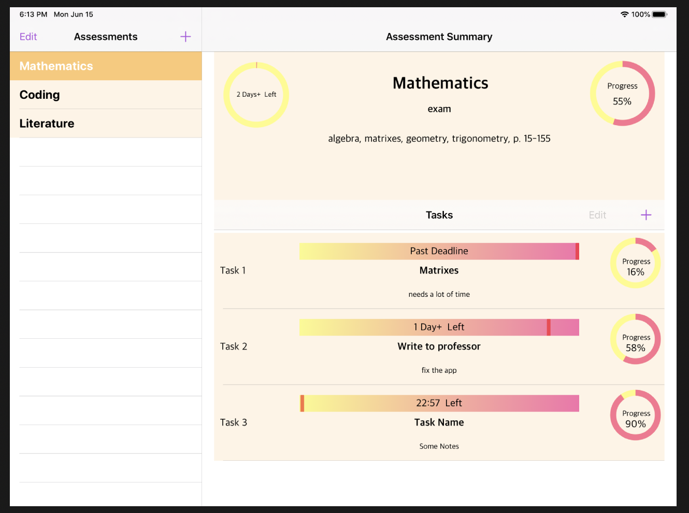

# Study-Time-Control-iPad-App
The software allows user to save assessments which can have tasks, events, reminders, alerts. Displays some basic statistics. Uses core data. Uses some custom graphics elements.

### Short description of program behaviour

1. The user can add assessment.  
2. The user can save assessment's date, time, deadline and all the information, which was typed in  
3. The user can edit assessment's all information or delete it.
4. Each assessment can have many tasks.  
5. The tasks can have name, notes, time, amount completed (0-100%), deadline.  
6. The summary is displayed for each assessment.  
6.1. In the summary, average progress (of all tasks) is displayed  
6.2. In the summary, time left for the assessment is displayed  
6.3. In the summary, all the assessments data is displayed  
6.4. In the summary, the time left is displayed. 
7. The tasks can be edited, deleted.
8. Upon modifying/deleting tasks, the summary is updated.
9. The user can set reminders/alerts for all the assessments and tasks.
10. Each new assessment is automatically added to calendar.

The program uses Core Data to store the information related.

All the time left caclulations looks at the interval between when the task/assessment was set, what is the time now, and when is it the deadline for it.

### Example

